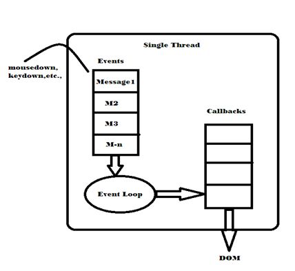
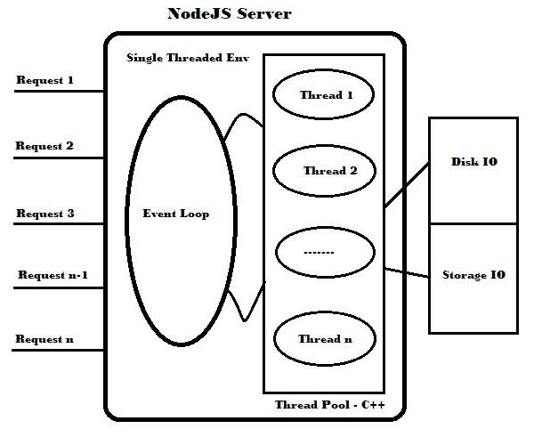

# Event/Async

## Q1：Node.js 中定时功能的顺序是怎样的？

Node.js 的定时器模块提供了在一段时间之后执行一些函数的功能。

- **setTimeout/clearTimeout** - 用于在指定的毫秒数后执行代码块（仅执行一次）

- **setInterval/clearInterval** - 用于在指定的毫秒数后循环执行代码块（循环执行）

- **setImmediate/clearImmediate** - 在当前事件循环周期结束后执行代码块

- **process.nextTick** - 在当前执行栈尾部，Event-Loop 之前触发

**timer 的执行顺序**

```
process.nextTick > setImmidate > setTimeout / SetInterval
```

**示例**

```js
function cb(msg){
    return function() {
        console.log(msg);
    }
}

setTimeout(cb('setTimeout'), 1000);
setImmediate(cb('setImmediate'))
process.nextTick(cb('process.nextTick'));
cb('Main process')();
```

Output:

```bash
Main process
process.nextTick
setImmediate
setTimeout
```

Source: [https://dev.to/aershov24/7-hardest-nodejs-interview-questions--answers-3lje](https://dev.to/aershov24/7-hardest-nodejs-interview-questions--answers-3lje)

## Q2：process.nextTick 与 setTimeout 递归调用区别？

process.nextTick 属于微任务，是在当前执行栈的尾部，Event Loop 之前触发，下面两个都是递归调用，test1 中 process.nextTick 是在当前执行栈调用，是一次性执行完，相当于 while(true){}，主线程陷入了死循环，阻断 IO 操作。

test2 方法中，setTimeout 属于宏任务，在任务队列中同样也是递归，但是它并不是一次性的执行而是会多次 Event Loop，不会阻断 IO 操作，另外注意 setTimeout 有一个最小的时间 4ms。

```javascript
function test1() {
    process.nextTick(() => test());
}

function test2() {
    setTimeout(() => test(), 0);
}
```

process.nextTick 将会阻塞 IO，setImmediate 不会输出

```js
function test() {
    return process.nextTick(() => test());
}

test();

setImmediate(() => {
    console.log('setImmediate');
})
```

下面使用 setTimeout 不会造成 IO 阻塞，会输出 setImmediate

```js
function test() { 
    setTimeout(() => test(), 0);
}

test()

setImmediate(() => {
    console.log('setImmediate');
})

// setImmediate
```

## Q3：什么是 EventLoop（事件循环）？

总结起来一句话概括，事件轮询是 JS 实现异步的具体解决方案，同步代码直接执行，异步函数或代码块先放在异步队列中，待同步函数执行完毕，轮循执行异步队列的函数。

## Q4：解释下 JavaScript 中的 EventLoop（事件循环）？

众所周知，JavaScript 是单线程的，当发起一个请求时会通过回调函数来接收后续的事件响应，不会造成阻塞，继续接收下一次请求操作。



1. 当触发一个事件时，相应的这个事件会进入到一个 EventLoop 队列中
2. 检查 EventLoop 中是否存在事件消息，如果消息存在则会触发相应的回调
3. 处理完成回调中的操作，就会返回到步骤 2 进行下一次 EventLoop

注意：如果 JavaScript 运行时同其它的事件消息一起被使用，则其它的事件消息必须等到当前消息处理完成。当时在浏览器上预览时一些东西时，有时你可能会看到 “浏览器没有响应”，这是因为有太耗时的事件消息，因此，尽可能的保证你的事件消息不要太耗时。

例如：

```js
var msg = document.getElementById("msg");  
    msg.addEventListener("click", function () {  
    this.style.color = "blue";  
});  
```

在上面例子中我们单击 msg 元素，将会触发一次事件消息，该事件消息会入一个“事件队列”中。

如果此时事件队列中有消息，则会等待其它的消息完成之后，在去处理我们的 msg 事件消息并将完成结果渲染到 DOM 中。

## Q5: 解释下 NodeJS 中的 EventLoop（事件循环）？

* 当收到一个请求时，它将使用一个 JavaScript 闭包排队进入 EventLoop，该闭包包括这个事件（request 和 response）和相应的回调。

* 如果这个工作需要很长时间才能完成，将会分配一个工作线程给予这个事件来处理，这个工作线程来自 C++ 线程池，由 Libuv 库处理。

* 一旦这个工作完成，将会触发相应的回调将响应结果返回给主线程

* Event Loop 将响应返回给客户端

下图展示了 Node.js EventLoop 的体系结构



例如:

```js
var fs = require('fs');  
fs.readFile('avator.png', function(avator) {  
    console.log(‘image is loaded…’);  
});  
fs.writeFile('log.txt', 'Done', function() {  
    console.log(‘Done !..’);  
});  
```

执行流程如下所示：

* 以上我们的代码会告诉这个节点有两个任务 read() and write() 需要执行，之后会休息一下。

* read() and write() 这两个操作将会进入 Event Loop 事件队列并将这个 job 分发到工作线程。

* 一旦工作线程完成这个 job，它将触发回调返回响应到 Event Loop。

* 之后 Event Loop 返回响应到客户端.

将会按照第一个先完成这样顺序执行  read() and write() 的回调。但是请注意，一次仅能执行一个回调，所以在 Node.js 环境中不会出现死锁和资源竞争的问题。因此，它可以确保 Node.js 能够提供非阻塞 I/O 模型。

对这个 Node.js Event Loop 的理解我们举一个邮局场景说明。

当我们想要发布或请求一些事情时，这个邮政领导可以要求邮递员发送邮件到相应的地址。

一旦这个邮递员完成邮件投递，他们将会一个一个（这里想要表明是顺序的）向邮政领导报告邮件已经完成。

如果这个邮递员在有时间的情况下，邮政领导也可以派发一些工作给他。

Source: [Introduction to NodeJS, A SSJS: Part II - EventLoop Explained](https://www.c-sharpcorner.com/article/node-js-interview-questions-and-answers/)

## Q6: Node.js 中的 Event Loop 有哪几个阶段，且每个阶段进行一下描述？

以下为 Node.js 官网提供的说明，这是一次事件循环所经历的六个阶段，这些阶段也是按照顺序依次执行的，在以下阶段中，每个阶段都会有一个先进先出的回调函数队列，只有当前阶段的回调函数队列清空了，才会进入到下一个阶段。

```js
┌───────────────────────────┐
┌─>│           timers          │
│  └─────────────┬─────────────┘
│  ┌─────────────┴─────────────┐
│  │     pending callbacks     │
│  └─────────────┬─────────────┘
│  ┌─────────────┴─────────────┐
│  │       idle, prepare       │
│  └─────────────┬─────────────┘      ┌───────────────┐
│  ┌─────────────┴─────────────┐      │   incoming:   │
│  │           poll            │<─────┤  connections, │
│  └─────────────┬─────────────┘      │   data, etc.  │
│  ┌─────────────┴─────────────┐      └───────────────┘
│  │           check           │
│  └─────────────┬─────────────┘
│  ┌─────────────┴─────────────┐
└──┤      close callbacks      │
   └───────────────────────────┘
```

下面对每个阶段做一个解释，同官网一样，你也可以参考官网说明 [https://nodejs.org/en/docs/guides/event-loop-timers-and-nexttick/](https://nodejs.org/en/docs/guides/event-loop-timers-and-nexttick/)

#### timers 定时器

定时器阶段会执行 setTimeout() 和 setInterval() 两个回调函数，在这个阶段主线程会检查当前时间是否满足定时器的条件，如果满足就执行，不满足会跳过进入下一个阶段，如果在下一个阶段阻塞了，那么再进入定时器执行时，时间可能就不那么准确了。

#### pending callbacks

pending callbacks 意为挂起的回调函数，此阶段对某些系统操作（如 TCP 错误类型）执行回调。例如，如果 TCP 套接字在尝试连接时接收到 ECONNREFUSED，则某些 *nix 的系统希望等待报告错误。这将被排队以在 挂起的回调阶段执行。

以下回调函数排除

* setTimeout()和setInterval()的回调函数
* setImmediate()的回调函数
* 用于关闭请求的回调函数，比如socket.on('close', ...)

#### idle, prepare 

该阶段仅系统内部（libuv）调用

#### poll

检索新的 I/O 事件;执行与 I/O 相关的回调（几乎所有情况下，除了关闭的回调函数，它们由计时器和 setImmediate() 排定的之外），其余情况 node 将在此处阻塞。

#### check

setImmediate() 回调函数在这里执行。

#### close callbacks 

一些准备关闭的回调函数，如：socket.on('close', ...)。

## Q7：什么是 Event Loop 和 Event Emitter ?

**Event Loop**
Node.js 虽是单线程应用程序，但是其基于 events and callbacks 机制，可以很好的完成并发操作。Node thread 会保持一个 EventLoop（事件循环）当任何任务完成时该节点都会触发相应的回调。

**Event Emitter**
每当完成任何任务、发生任何错误、添加一个 listener 或删除一个 listener 时，EventEmitter 都会触发一个事件。它提供了 on 和 emit 等属性，on 用于绑定函数，emit 用于触发事件。

Source: [top-20-interview-questions-on-nodejs](https://www.codingdefined.com/2017/04/top-20-interview-questions-on-nodejs.html)

## Q8: 描述下 Linux/Unix 中的几种 I/O 模型?

I/O 模型的演进：同步阻塞IO -> 同步非阻塞IO -> IO多路复用 -> 信号驱动IO -> 异步IO模型，更多可参考 [操作系统的轮询技术演进](https://mp.weixin.qq.com/s/t8pH3xqPS5CiuyaUx-8wcA)

## Q9: I/O 多路复用模式下 select 和 epoll 的区别？

在操作方式上 select 采用了线性遍历来查找，链接多了之后可以想象一下在一个诺大的数组中每次通过遍历来锁定一个链接，是多么的消耗性能。epoll 则不需要遍历，采用的是回调机制，可以看作一个H ashTable，锁定一个对象是很快的。对于文件描述符（最大连接数）select 限制为 1024，epoll 则没有这个限制，通常在 1G 内存的机器上所能支持的连接数为 10W 左右 (cat /proc/sys/fs/file-max)。

从操作系统支持上来看，目前流行的高性能 Web 服务器 Nginx 是基于 epoll 来实现高并发，当然如果你的链接很小的情况下区别还是不大的 select 也能满足，如果是大流量、高并发情况 epoll 目前还是首选模型。

## Q10: setTimeout/setInterval 定时器时间是否精确？

当实现一些定时任务的时候可能会想到使用 setTimeout/setInterval，但是它们的时间是精确的吗？其实不然，例如代码块 ```setTimeout(function(){}, 5)```，虽然设置为 5，但并不能保证会在这个时间立即执行，在 JavaScript 代码执行时会在合适的时间将代码插入任务队列，真正执行是要进到事件循环以后才开始的，在 Node.js 中每次事件循环都会经过六个阶段，当进入 timers 阶段时，开始处理 setTimeout/setInterval 这两个函数，在这个阶段主线程会检查当前时间是否满足定时器的条件，如果满足就执行，不满足会跳过进入下一个阶段，如果在下一个阶段阻塞了，那么再进入定时器执行时，时间可能就不那么准确了。

在官网介绍中也有这样一段话描述 **```however, Operating System scheduling or the running of other callbacks may delay them.```** 因此，setTimeout/setInterval 定时器时间并不是完全精确的（其实也在容忍范围，大部分业务是可以的），假如真的需要做一个精确的定时任务该怎么做呢？可以借助 MQ 实现，之前介绍过一篇文章 [Node.js 结合 RabbitMQ 延迟队列实现定时任务](https://mp.weixin.qq.com/s/d-mEZQdY4ZFrNxqbH_Wj7A) 可以用于订单超时自动取消、定时重试等业务系统。

## Q11: Promise的基本使用和原理？

* 如何异常捕获（Error、reject）通过catch捕获
* 多个串联-链式执行的好处
* Promise.all（并发执行） 和 Promise.race（随机执行）
* Promise 标准-状态变化（Pending —— Fulfilled/Rejected）状态之间是不可逆的
* then 函数，不明文指定返回实例，返回本身的 promise 实例，否则返回指定的 promise 实例

## Q12: 介绍一下 async/await（和Promise的区别、联系）?

* await后面必须是一个promise实例，函数外层需要加上async修饰
* 使用了Promise，并没有和Promise冲突，完全是同步的写法，没有了回调函数

## Q13: 如何实现一个 Promise？ 

```js
// todo:
```

## Q14: 介绍下 Jquery 中的 Deferred 解决方案？

Jquery1.5 之后出现了 Deferred，是最早提出解决异步的方式。Promise 也是从 Deferred 演变过来的，最后逐渐一套标准，独立出来了。重点还是回归到问题本身，Deferred 是 Jquery1.5 版本对 Ajax 的改变衍生出来的一个东西，其遵循**对扩展开放修改封闭**原则，看下以下封装示例：

```html
<script>
	// 异步加载图片示例
	function loadImage(src) {
		var dtd = $.Deferred();
		var img = document.createElement('img');

		img.src = src;
		img.onload = function() {
			dtd.resolve(img);
		}

		img.onerror = function(err) {
			dtd.reject(err);
		}

		return dtd.promise();// 返回promise对象，而不是直接返回deferred对象
	}

	loadImage('https://images.pexels.com/photos/457044/pexels-photo-457044.jpeg?auto=compress&cs=tinysrgb&dpr=2&w=500')
		.then(function(result) {
			document.body.appendChild(result);

			console.log(result);
		})
		.catch(function(err) {
			console.error(err);
		})
</script>
```

**Deferred 与promise 的区别**

Deferred 这种对象有主动触发 resolve、reject 这种函数，也有 done、fail、then 这种被动监听函数，这些函数混在一块很容易被外部篡改，通过生成promise 对象进行隔离，promise 只有被动监听，没有主动修改。